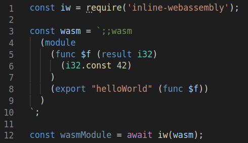

# inline-webassembly
Easiest way to write WebAssembly

[](https://badge.fury.io/js/inline-webassembly)


## Installation

```shell
$ npm install --save inline-webassembly
```

## Usage

```js
const iw = require('inline-webassembly');
// or
import * as iw from 'inline-webassembly';
```

## Loading in browser
Assuming that your JS file is named `main.js`
```shell
$ npm i -g browserify
$ browserify main.js -o bundle.js
```
then
```html
<script src="bundle.js"></script>
```

## Syntax highlight (VS Code)
To have WebAssembly syntax highlighting in VS Code, use extension: <a href="https://marketplace.visualstudio.com/items?itemName=dorin131.vscode-inline-webassembly&ssr=false#overview">Inline WebAssembly Syntax Highlight</a>



## API

### WasmModule

The constructor is going to return an instance of *WasmModule* which is an extension of the original WasmModule returned by the underlying <a href="https://www.npmjs.com/package/wabt">wabt</a> package.

Additional helper methods:

 **readString**(index: `number`, length?: `number`): `string`
 Returns a string, provided an index, which should be a pointer in the module memory. 

 **createString**(string: `string`, memoryLocation?: `number`): `number`
 Creates a string in the module memory and returns a pointer to it.

## Getting started

### Add two numbers

```js
const iw = require('inline-webassembly');

iw(`
  (module
    (func (export "add") (param $n1 i32) (param $n2 i32) (result i32)
      get_local $n1
      get_local $n2
      i32.add))`
).then((wasmModule) => {
  const sum = wasmModule.add(44, 99);
  console.log(`Sum = ${sum}`); // 143
});
```

## Other examples

### Read a string from memory

```js
const iw = require('inline-webassembly');

iw(`
  (module
    (memory (export "memory") 1)
    (func (export "hello") (result i32)
      i32.const 16
    )
    (data (i32.const 16)
      "Hello World"
    )
  )`
).then((wasmModule) => {
  const stringPointer = wasmModule.hello(44, 99);
  const string = wasmModule.readString(stringPointer)
  console.log(`Result = ${string}`); // Hello World
});
```

### Call a JS function from WebAssembly

```js
const iw = require('inline-webassembly');

const sayHey = function() {
  console.log('Hey!')
}

iw(`
  (module
    (import "env" "sayHey" (func $sayHey))
    (func (export "hello")
      (call $sayHey)
    )
  )`, { env: { sayHey }}
).then((wasmModule) => {
  wasmModule.hello(); // Hey!
});
```

### Reverse a string

```js
const iw = require('inline-webassembly');

iw(`
  (module
    (memory $0 1)
    (export "memory" (memory $0))
    ;; declaring and exporting a function named "reverse"
    ;; it takes two arguments, the pointer to a string and its length
    ;; and it returns a 32 bit integer which is going to be the pointer
    ;; to the reversed string
    (func (export "reverse") (param $sref i32) (param $slen i32) (result i32)

      ;; declaring new variable to store result pointer
      (local $result i32)

      ;; seclaring iterator variable
      (local $iterator i32)

      ;; write pointer
      (local $write_to i32)

      ;; setting $result = $sref + $slen + 1
      (set_local $result
        ;; adding 1
        (i32.add
          ;; adding the string pointer with its length
          (i32.add
            (get_local $sref)
            (get_local $slen)
          )
          (i32.const 1)
        )
      )
      
      ;; setting iterator to 0, for the following loop
      (set_local $iterator
        (i32.const 0)  
      )

      ;; we'll start writing to the start of the result
      (set_local $write_to
        (get_local $result)  
      )
        
      (block
        (loop
          
          ;; store one character from original string to resulting string
          (i32.store
            (get_local $write_to)
            ;; load 1 byte and sign-extend i8 to i32
            (i32.load8_s
              (i32.sub
                (i32.sub
                  (i32.add
                    (get_local $sref)
                    (get_local $slen)
                  )
                  (get_local $iterator)
                )
                (i32.const 1)
              )
            )  
          )

          ;; increment position to write to on next loop iteration
          (set_local $write_to
            (i32.add
              (get_local $write_to)
              (i32.const 1)  
            )  
          )

          ;; increment iterator by 1 for every loop iteration
          (set_local $iterator
            (i32.add
              (get_local $iterator)
              (i32.const 1)  
            )  
          )
          
          ;; break loop if iterator reaches string length
          (br_if 1
            (i32.ge_s
              (get_local $iterator)
              (get_local $slen)
            )
          )
          
          ;; repeat loop
          (br 0)
        )
      )

      ;; returning result which contains pointer to the reversed string
      (get_local $result)
    )
  )`
).then((wasmModule) => {
  const stringToReverse = wasmModule.createString('Dorin');
  const resultPointer = wasmModule.reverse(stringToReverse, 5);
  const resultString = wasmModule.readString(resultPointer);
  console.log(`Result = ${resultString}`);
});
```